# ASPNETCORE-WEB-API-XtraWork-PART-4-EXAMEN


# EXAMEN : API Web ASP.NET Core - EduTrack

## Informations Générales

**Titre :** Développement d'une API REST pour la Gestion de Cours en Ligne  
**Projet :** EduTrack API  
**Durée :** 4 heures  
**Note :** /100 points  
**Type :** Examen pratique individuel  
**Date :** À définir

---

## Contexte

Vous êtes chargé de développer une **API REST** pour une plateforme de formation en ligne appelée **EduTrack**.

Cette API doit permettre de :
- Gérer un catalogue de cours
- Gérer les formateurs (instructeurs)
- Gérer les inscriptions des étudiants
- Implémenter une authentification JWT
- Appliquer des autorisations basées sur les rôles
- Valider les données avec FluentValidation

---

## Objectifs Pédagogiques

À la fin de cet examen, vous devez démontrer votre maîtrise de :

1. ‚úÖ **Entity Framework Core** (Code First)
2. ‚úÖ **Architecture en couches** (Repository, Service, Controller)
3. ‚úÖ **Authentification JWT** avec BCrypt
4. ✅ **Autorisation par rôles** (3 rôles différents)
5. ✅ **FluentValidation** pour la validation avancée
6. ‚úÖ **Swagger** pour la documentation
7. ‚úÖ **Serilog** pour le logging
8. ‚úÖ **Gestion d'erreurs** globale

---

## Schéma de Base de Données

### Diagramme Entité-Relation (ERD)

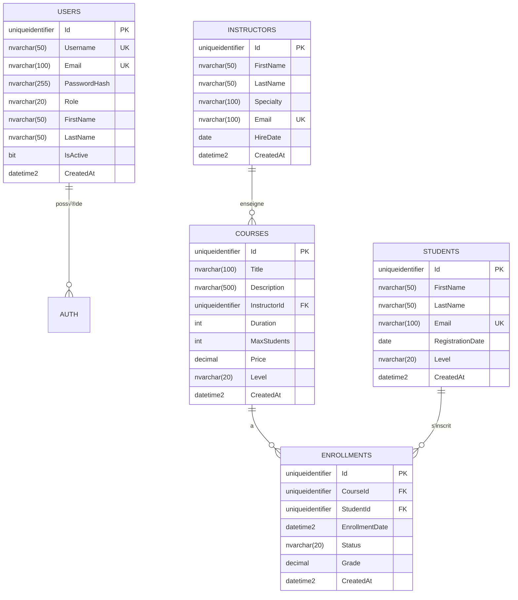
```mermaid
erDiagram
    USERS ||--o{ AUTH : "possède"
    INSTRUCTORS ||--o{ COURSES : "enseigne"
    COURSES ||--o{ ENROLLMENTS : "a"
    STUDENTS ||--o{ ENROLLMENTS : "s'inscrit"
    
    USERS {
        uniqueidentifier Id PK
        nvarchar(50) Username UK
        nvarchar(100) Email UK
        nvarchar(255) PasswordHash
        nvarchar(20) Role
        nvarchar(50) FirstName
        nvarchar(50) LastName
        bit IsActive
        datetime2 CreatedAt
    }
    
    INSTRUCTORS {
        uniqueidentifier Id PK
        nvarchar(50) FirstName
        nvarchar(50) LastName
        nvarchar(100) Specialty
        nvarchar(100) Email UK
        date HireDate
        datetime2 CreatedAt
    }
    
    COURSES {
        uniqueidentifier Id PK
        nvarchar(100) Title
        nvarchar(500) Description
        uniqueidentifier InstructorId FK
        int Duration
        int MaxStudents
        decimal Price
        nvarchar(20) Level
        datetime2 CreatedAt
    }
    
    STUDENTS {
        uniqueidentifier Id PK
        nvarchar(50) FirstName
        nvarchar(50) LastName
        nvarchar(100) Email UK
        date RegistrationDate
        nvarchar(20) Level
        datetime2 CreatedAt
    }
    
    ENROLLMENTS {
        uniqueidentifier Id PK
        uniqueidentifier CourseId FK
        uniqueidentifier StudentId FK
        datetime2 EnrollmentDate
        nvarchar(20) Status
        decimal Grade
        datetime2 CreatedAt
    }
```

### Relations

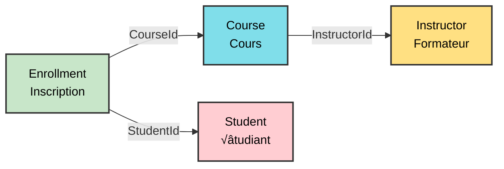
```mermaid
graph LR
    Course["Course<br/>Cours"]
    Instructor["Instructor<br/>Formateur"]
    Student["Student<br/>Étudiant"]
    Enrollment["Enrollment<br/>Inscription"]
    
    Course -->|InstructorId| Instructor
    Enrollment -->|CourseId| Course
    Enrollment -->|StudentId| Student
    
    style Course fill:#80DEEA,color:#000,stroke:#333,stroke-width:2px
    style Instructor fill:#FFE082,color:#000,stroke:#333,stroke-width:2px
    style Enrollment fill:#C8E6C9,color:#000,stroke:#333,stroke-width:2px
    style Student fill:#FFCDD2,color:#000,stroke:#333,stroke-width:2px
```

**Version Verticale (Alternative) :**

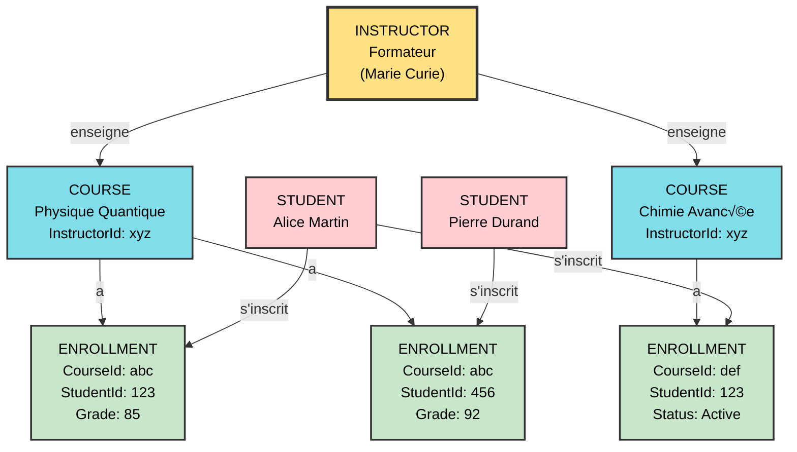
```mermaid
graph TB
    Instructor["INSTRUCTOR<br/>Formateur<br/>(Marie Curie)"]
    Course1["COURSE<br/>Physique Quantique<br/>InstructorId: xyz"]
    Course2["COURSE<br/>Chimie Avancée<br/>InstructorId: xyz"]
    
    Student1["STUDENT<br/>Alice Martin"]
    Student2["STUDENT<br/>Pierre Durand"]
    
    Enroll1["ENROLLMENT<br/>CourseId: abc<br/>StudentId: 123<br/>Grade: 85"]
    Enroll2["ENROLLMENT<br/>CourseId: abc<br/>StudentId: 456<br/>Grade: 92"]
    Enroll3["ENROLLMENT<br/>CourseId: def<br/>StudentId: 123<br/>Status: Active"]
    
    Instructor -->|enseigne| Course1
    Instructor -->|enseigne| Course2
    
    Course1 -->|a| Enroll1
    Course1 -->|a| Enroll2
    Course2 -->|a| Enroll3
    
    Student1 -->|s'inscrit| Enroll1
    Student2 -->|s'inscrit| Enroll2
    Student1 -->|s'inscrit| Enroll3
    
    style Instructor fill:#FFE082,color:#000,stroke:#333,stroke-width:3px
    style Course1 fill:#80DEEA,color:#000,stroke:#333,stroke-width:2px
    style Course2 fill:#80DEEA,color:#000,stroke:#333,stroke-width:2px
    style Student1 fill:#FFCDD2,color:#000,stroke:#333,stroke-width:2px
    style Student2 fill:#FFCDD2,color:#000,stroke:#333,stroke-width:2px
    style Enroll1 fill:#C8E6C9,color:#000,stroke:#333,stroke-width:2px
    style Enroll2 fill:#C8E6C9,color:#000,stroke:#333,stroke-width:2px
    style Enroll3 fill:#C8E6C9,color:#000,stroke:#333,stroke-width:2px
```

**Relations :**
- Un **Instructor** peut enseigner **plusieurs Courses** (1:N)
- Un **Course** est enseigné par **un seul Instructor** (N:1)
- Un **Enrollment** lie **un Student** à **un Course** (N:M via table de jonction)

---

## Spécifications des Entités

### 1. Entity User

```csharp
public class User
{
    public Guid Id { get; set; }
    public string Username { get; set; }
    public string Email { get; set; }
    public string PasswordHash { get; set; }
    public string FirstName { get; set; }
    public string LastName { get; set; }
    public string Role { get; set; } = "Student"; // Student, Instructor, Admin
    public bool IsActive { get; set; } = true;
    public DateTime CreatedAt { get; set; } = DateTime.UtcNow;
}
```

### 2. Entity Instructor

```csharp
public class Instructor
{
    public Guid Id { get; set; }
    public string FirstName { get; set; }
    public string LastName { get; set; }
    public string Specialty { get; set; }
    public string Email { get; set; }
    public DateTime HireDate { get; set; }
    public DateTime CreatedAt { get; set; } = DateTime.UtcNow;
    
    // Navigation property
    public ICollection<Course> Courses { get; set; } = new List<Course>();
}
```

### 3. Entity Course

```csharp
public class Course
{
    public Guid Id { get; set; }
    public string Title { get; set; }
    public string Description { get; set; }
    public Guid InstructorId { get; set; }
    public int Duration { get; set; } // En heures
    public int MaxStudents { get; set; }
    public decimal Price { get; set; }
    public string Level { get; set; } // Beginner, Intermediate, Advanced
    public DateTime CreatedAt { get; set; } = DateTime.UtcNow;
    
    // Navigation properties
    public Instructor Instructor { get; set; } = null!;
    public ICollection<Enrollment> Enrollments { get; set; } = new List<Enrollment>();
}
```

### 4. Entity Student

```csharp
public class Student
{
    public Guid Id { get; set; }
    public string FirstName { get; set; }
    public string LastName { get; set; }
    public string Email { get; set; }
    public DateTime RegistrationDate { get; set; }
    public string Level { get; set; } // Beginner, Intermediate, Advanced
    public DateTime CreatedAt { get; set; } = DateTime.UtcNow;
    
    // Navigation property
    public ICollection<Enrollment> Enrollments { get; set; } = new List<Enrollment>();
}
```

### 5. Entity Enrollment

```csharp
public class Enrollment
{
    public Guid Id { get; set; }
    public Guid CourseId { get; set; }
    public Guid StudentId { get; set; }
    public DateTime EnrollmentDate { get; set; } = DateTime.UtcNow;
    public string Status { get; set; } = "Active"; // Active, Completed, Cancelled
    public decimal? Grade { get; set; } // Note entre 0 et 100 (nullable)
    public DateTime CreatedAt { get; set; } = DateTime.UtcNow;
    
    // Navigation properties
    public Course Course { get; set; } = null!;
    public Student Student { get; set; } = null!;
}
```

---

## Permissions par Rôle

### Diagramme Général des Rôles

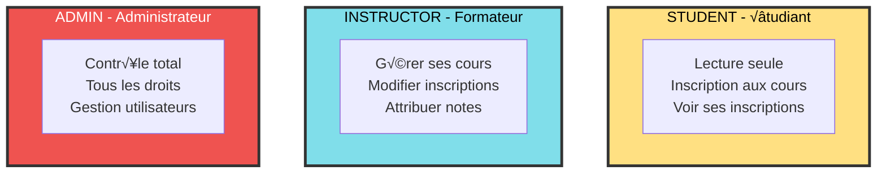
```mermaid
graph TB
    subgraph StudentRole["STUDENT - Étudiant"]
        SR["Lecture seule<br/>Inscription aux cours<br/>Voir ses inscriptions"]
    end
    
    subgraph InstructorRole["INSTRUCTOR - Formateur"]
        IR["Gérer ses cours<br/>Modifier inscriptions<br/>Attribuer notes"]
    end
    
    subgraph AdminRole["ADMIN - Administrateur"]
        AR["Contrôle total<br/>Tous les droits<br/>Gestion utilisateurs"]
    end
    
    style StudentRole fill:#FFE082,color:#000,stroke:#333,stroke-width:3px
    style InstructorRole fill:#80DEEA,color:#000,stroke:#333,stroke-width:3px
    style AdminRole fill:#EF5350,color:#fff,stroke:#333,stroke-width:3px
```

---

## RÔLE 1 : STUDENT (Étudiant)

### Diagramme des Permissions


```mermaid
graph TB
    Student["RÔLE : STUDENT<br/>Étudiant"]
    
    subgraph Autorise["PEUT FAIRE"]
        direction TB
        SA["Lire tous les Courses"]
        SB["Lire tous les Instructors"]
        SC["Lire tous les Students"]
        SD["S'inscrire à un cours<br/>(POST Enrollment)"]
        SE["Voir ses propres inscriptions"]
        SF["Se connecter"]
        SG["Voir son profil"]
    end
    
    subgraph Interdit["NE PEUT PAS"]
        direction TB
        SX["Créer/Modifier/Supprimer Course"]
        SY["Créer/Modifier/Supprimer Instructor"]
        SZ["Créer/Modifier/Supprimer Student"]
        SW["Modifier/Supprimer Enrollment"]
        SV["Attribuer des notes"]
    end
    
    Student --> SA
    Student --> SB
    Student --> SC
    Student --> SD
    Student --> SE
    Student --> SF
    Student --> SG
    
    Student -.-> SX
    Student -.-> SY
    Student -.-> SZ
    Student -.-> SW
    Student -.-> SV
    
    style Student fill:#FFE082,color:#000,stroke:#333,stroke-width:4px
    style Autorise fill:#C8E6C9,color:#000,stroke:#4CAF50,stroke-width:3px
    style Interdit fill:#FFCDD2,color:#000,stroke:#F44336,stroke-width:3px
```

**Version Simplifiée (Alternative) :**

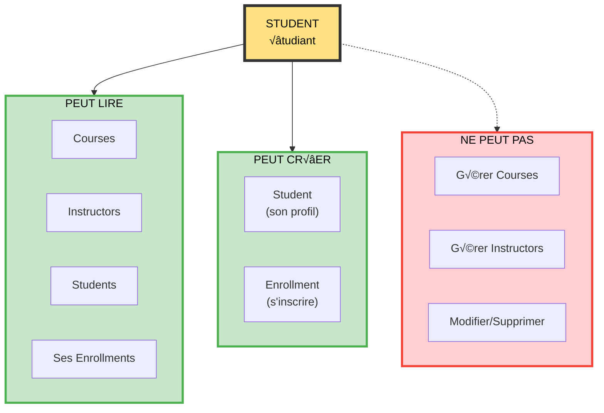
```mermaid
graph TB
    Student["STUDENT<br/>Étudiant"]
    
    Student --> Lecture
    Student --> Creer
    Student -.-> Interdit
    
    subgraph Lecture["PEUT LIRE"]
        direction LR
        L1["Courses"]
        L2["Instructors"]
        L3["Students"]
        L4["Ses Enrollments"]
    end
    
    subgraph Creer["PEUT CRÉER"]
        direction LR
        C1["Student<br/>(son profil)"]
        C2["Enrollment<br/>(s'inscrire)"]
    end
    
    subgraph Interdit["NE PEUT PAS"]
        direction LR
        I1["Gérer Courses"]
        I2["Gérer Instructors"]
        I3["Modifier/Supprimer"]
    end
    
    style Student fill:#FFE082,color:#000,stroke:#333,stroke-width:4px
    style Lecture fill:#C8E6C9,color:#000,stroke:#4CAF50,stroke-width:3px
    style Creer fill:#C8E6C9,color:#000,stroke:#4CAF50,stroke-width:3px
    style Interdit fill:#FFCDD2,color:#000,stroke:#F44336,stroke-width:3px
```

### Tableau des Permissions - STUDENT

| Endpoint | Méthode | Autorisé | Code Attendu |
|----------|---------|----------|--------------|
| `/api/courses` | GET | ‚úÖ OUI | 200 |
| `/api/courses/{id}` | GET | ‚úÖ OUI | 200 |
| `/api/courses` | POST | ‚ùå NON | 403 |
| `/api/courses/{id}` | PUT | ‚ùå NON | 403 |
| `/api/courses/{id}` | DELETE | ‚ùå NON | 403 |
| `/api/instructors` | GET | ‚úÖ OUI | 200 |
| `/api/instructors/{id}` | GET | ‚úÖ OUI | 200 |
| `/api/instructors` | POST | ‚ùå NON | 403 |
| `/api/students` | GET | ‚úÖ OUI | 200 |
| `/api/students` | POST | ‚úÖ OUI | 201 |
| `/api/students/{id}` | PUT | ‚ùå NON | 403 |
| `/api/enrollments` | GET | ‚úÖ OUI (ses propres) | 200 |
| `/api/enrollments` | POST | ‚úÖ OUI | 201 |
| `/api/enrollments/{id}` | PUT | ‚ùå NON | 403 |
| `/api/enrollments/{id}` | DELETE | ‚ùå NON | 403 |

### Cas d'Usage - STUDENT

**Peut faire :**
1. Consulter le catalogue de cours
2. Voir les profils des formateurs
3. S'inscrire à un cours
4. Voir ses propres inscriptions et notes
5. Créer son profil étudiant

**Ne peut pas faire :**
1. Créer ou modifier un cours
2. Créer ou modifier un formateur
3. Annuler une inscription
4. Modifier sa note
5. Voir les inscriptions des autres étudiants

---

## RÔLE 2 : INSTRUCTOR (Formateur)

### Diagramme des Permissions


```mermaid
graph TB
    Instructor["RÔLE : INSTRUCTOR<br/>Formateur"]
    
    subgraph Autorise["PEUT FAIRE"]
        direction TB
        IA["Lire tous les Courses"]
        IB["Créer un Course"]
        IC["Modifier ses propres Courses"]
        ID["Lire tous les Instructors"]
        IE["Lire tous les Students"]
        IF["Lire toutes les Enrollments"]
        IG["Modifier Enrollment<br/>(attribuer note)"]
        IH["Créer Student"]
        II["Se connecter"]
        IJ["Voir son profil"]
    end
    
    subgraph Interdit["NE PEUT PAS"]
        direction TB
        IX["Supprimer Course"]
        IY["Créer/Modifier/Supprimer Instructor"]
        IZ["Modifier/Supprimer Student"]
        IW["Supprimer Enrollment"]
    end
    
    Instructor --> IA
    Instructor --> IB
    Instructor --> IC
    Instructor --> ID
    Instructor --> IE
    Instructor --> IF
    Instructor --> IG
    Instructor --> IH
    Instructor --> II
    Instructor --> IJ
    
    Instructor -.-> IX
    Instructor -.-> IY
    Instructor -.-> IZ
    Instructor -.-> IW
    
    style Instructor fill:#80DEEA,color:#000,stroke:#333,stroke-width:4px
    style Autorise fill:#C8E6C9,color:#000,stroke:#4CAF50,stroke-width:3px
    style Interdit fill:#FFCDD2,color:#000,stroke:#F44336,stroke-width:3px
```

**Version Simplifiée (Alternative) :**

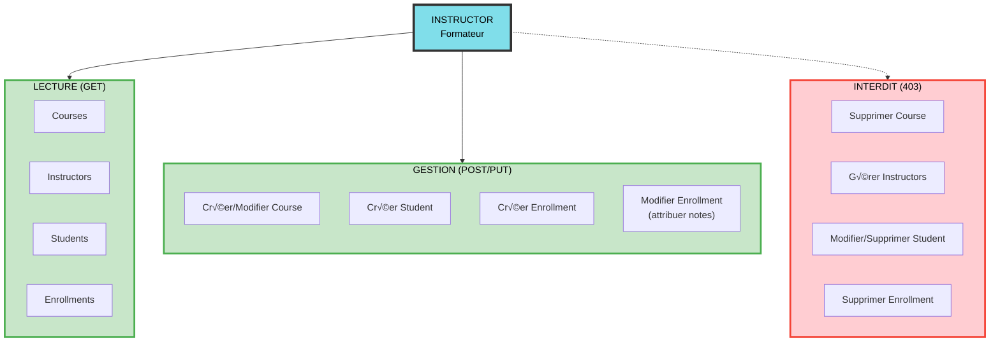
```mermaid
graph TB
    Instructor["INSTRUCTOR<br/>Formateur"]
    
    Instructor --> Lecture
    Instructor --> Gestion
    Instructor -.-> Interdit
    
    subgraph Lecture["LECTURE (GET)"]
        direction LR
        L1["Courses"]
        L2["Instructors"]
        L3["Students"]
        L4["Enrollments"]
    end
    
    subgraph Gestion["GESTION (POST/PUT)"]
        direction TB
        G1["Créer/Modifier Course"]
        G2["Créer Student"]
        G3["Créer Enrollment"]
        G4["Modifier Enrollment<br/>(attribuer notes)"]
    end
    
    subgraph Interdit["INTERDIT (403)"]
        direction LR
        I1["Supprimer Course"]
        I2["Gérer Instructors"]
        I3["Modifier/Supprimer Student"]
        I4["Supprimer Enrollment"]
    end
    
    style Instructor fill:#80DEEA,color:#000,stroke:#333,stroke-width:4px
    style Lecture fill:#C8E6C9,color:#000,stroke:#4CAF50,stroke-width:3px
    style Gestion fill:#C8E6C9,color:#000,stroke:#4CAF50,stroke-width:3px
    style Interdit fill:#FFCDD2,color:#000,stroke:#F44336,stroke-width:3px
```

### Tableau des Permissions - INSTRUCTOR

| Endpoint | Méthode | Autorisé | Code Attendu |
|----------|---------|----------|--------------|
| `/api/courses` | GET | ‚úÖ OUI | 200 |
| `/api/courses/{id}` | GET | ‚úÖ OUI | 200 |
| `/api/courses` | POST | ‚úÖ OUI | 201 |
| `/api/courses/{id}` | PUT | ‚úÖ OUI | 200 |
| `/api/courses/{id}` | DELETE | ‚ùå NON | 403 |
| `/api/instructors` | GET | ‚úÖ OUI | 200 |
| `/api/instructors/{id}` | GET | ‚úÖ OUI | 200 |
| `/api/instructors` | POST | ‚ùå NON | 403 |
| `/api/instructors/{id}` | PUT | ‚ùå NON | 403 |
| `/api/instructors/{id}` | DELETE | ‚ùå NON | 403 |
| `/api/students` | GET | ‚úÖ OUI | 200 |
| `/api/students` | POST | ‚úÖ OUI | 201 |
| `/api/students/{id}` | PUT | ‚ùå NON | 403 |
| `/api/enrollments` | GET | ‚úÖ OUI | 200 |
| `/api/enrollments` | POST | ‚úÖ OUI | 201 |
| `/api/enrollments/{id}` | PUT | ‚úÖ OUI | 200 |
| `/api/enrollments/{id}` | DELETE | ‚ùå NON | 403 |

### Cas d'Usage - INSTRUCTOR

**Peut faire :**
1. Créer et modifier ses cours
2. Consulter tous les cours
3. Voir la liste des étudiants
4. Voir toutes les inscriptions
5. Modifier les inscriptions (attribuer des notes)
6. Créer des profils étudiants

**Ne peut pas faire :**
1. Supprimer un cours
2. Créer ou modifier d'autres formateurs
3. Modifier ou supprimer des étudiants
4. Supprimer des inscriptions

---

## RÔLE 3 : ADMIN (Administrateur)

### Diagramme des Permissions

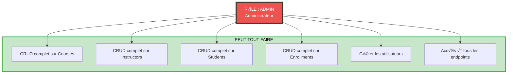
```mermaid
graph TB
    Admin["RÔLE : ADMIN<br/>Administrateur"]
    
    subgraph Autorise["PEUT TOUT FAIRE"]
        direction TB
        AA["CRUD complet sur Courses"]
        AB["CRUD complet sur Instructors"]
        AC["CRUD complet sur Students"]
        AD["CRUD complet sur Enrollments"]
        AE["Gérer les utilisateurs"]
        AF["Accès à tous les endpoints"]
    end
    
    Admin --> AA
    Admin --> AB
    Admin --> AC
    Admin --> AD
    Admin --> AE
    Admin --> AF
    
    style Admin fill:#EF5350,color:#fff,stroke:#333,stroke-width:4px
    style Autorise fill:#C8E6C9,color:#000,stroke:#4CAF50,stroke-width:3px
```

**Version Décomposée par Entité (Alternative) :**

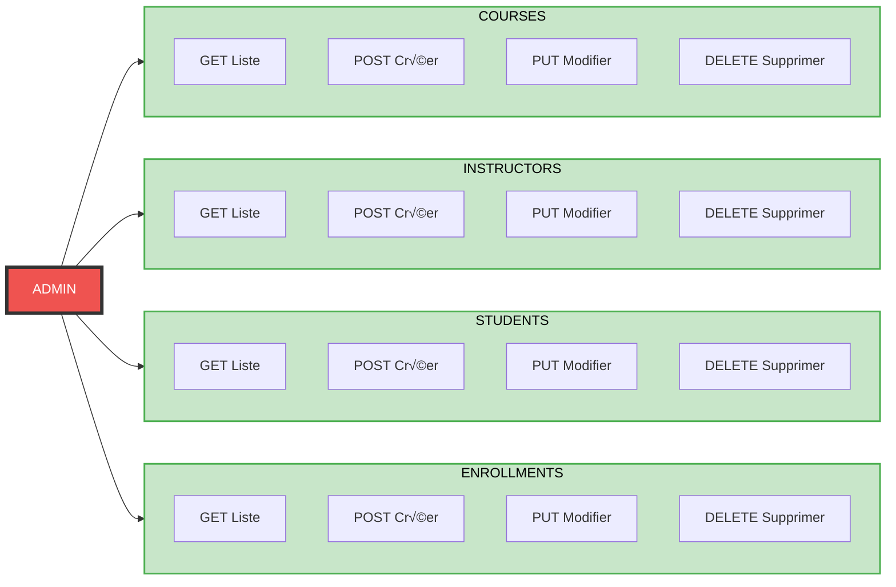
```mermaid
graph LR
    Admin["ADMIN"]
    
    Admin --> Courses
    Admin --> Instructors
    Admin --> Students
    Admin --> Enrollments
    
    subgraph Courses["COURSES"]
        direction TB
        C1["GET Liste"]
        C2["POST Créer"]
        C3["PUT Modifier"]
        C4["DELETE Supprimer"]
    end
    
    subgraph Instructors["INSTRUCTORS"]
        direction TB
        I1["GET Liste"]
        I2["POST Créer"]
        I3["PUT Modifier"]
        I4["DELETE Supprimer"]
    end
    
    subgraph Students["STUDENTS"]
        direction TB
        S1["GET Liste"]
        S2["POST Créer"]
        S3["PUT Modifier"]
        S4["DELETE Supprimer"]
    end
    
    subgraph Enrollments["ENROLLMENTS"]
        direction TB
        E1["GET Liste"]
        E2["POST Créer"]
        E3["PUT Modifier"]
        E4["DELETE Supprimer"]
    end
    
    style Admin fill:#EF5350,color:#fff,stroke:#333,stroke-width:4px
    style Courses fill:#C8E6C9,color:#000,stroke:#4CAF50,stroke-width:2px
    style Instructors fill:#C8E6C9,color:#000,stroke:#4CAF50,stroke-width:2px
    style Students fill:#C8E6C9,color:#000,stroke:#4CAF50,stroke-width:2px
    style Enrollments fill:#C8E6C9,color:#000,stroke:#4CAF50,stroke-width:2px
```

### Tableau des Permissions - ADMIN

| Endpoint | Méthode | Autorisé | Code Attendu |
|----------|---------|----------|--------------|
| **TOUS LES ENDPOINTS** | **TOUTES** | ‚úÖ OUI | 200/201/204 |

**L'Admin a tous les droits sur toutes les ressources.**

---

## Matrice Complète des Permissions


```mermaid
graph TB
    subgraph Legend["Légende"]
        OK["OUI - Autorisé"]
        NOK["NON - Interdit"]
    end
    
    subgraph Courses["Courses"]
        CGet["GET /courses"]
        CPost["POST /courses"]
        CPut["PUT /courses/:id"]
        CDel["DELETE /courses/:id"]
    end
    
    subgraph Instructors["Instructors"]
        IGet["GET /instructors"]
        IPost["POST /instructors"]
        IPut["PUT /instructors/:id"]
        IDel["DELETE /instructors/:id"]
    end
    
    subgraph Students["Students"]
        StGet["GET /students"]
        StPost["POST /students"]
        StPut["PUT /students/:id"]
        StDel["DELETE /students/:id"]
    end
    
    subgraph Enrollments["Enrollments"]
        EGet["GET /enrollments"]
        EPost["POST /enrollments"]
        EPut["PUT /enrollments/:id"]
        EDel["DELETE /enrollments/:id"]
    end
    
    StudentRole["STUDENT"] -.->|OUI| CGet
    StudentRole -.->|NON| CPost
    StudentRole -.->|NON| CPut
    StudentRole -.->|NON| CDel
    StudentRole -.->|OUI| IGet
    StudentRole -.->|NON| IPost
    StudentRole -.->|OUI| StGet
    StudentRole -.->|OUI| StPost
    StudentRole -.->|NON| StPut
    StudentRole -.->|OUI| EGet
    StudentRole -.->|OUI| EPost
    StudentRole -.->|NON| EPut
    StudentRole -.->|NON| EDel
    
    InstructorRole["INSTRUCTOR"] -.->|OUI| CGet
    InstructorRole -.->|OUI| CPost
    InstructorRole -.->|OUI| CPut
    InstructorRole -.->|NON| CDel
    InstructorRole -.->|OUI| IGet
    InstructorRole -.->|NON| IPost
    InstructorRole -.->|OUI| StGet
    InstructorRole -.->|OUI| StPost
    InstructorRole -.->|NON| StPut
    InstructorRole -.->|OUI| EGet
    InstructorRole -.->|OUI| EPost
    InstructorRole -.->|OUI| EPut
    InstructorRole -.->|NON| EDel
    
    AdminRole["ADMIN"] -.->|OUI| CGet
    AdminRole -.->|OUI| CPost
    AdminRole -.->|OUI| CPut
    AdminRole -.->|OUI| CDel
    AdminRole -.->|OUI| IGet
    AdminRole -.->|OUI| IPost
    AdminRole -.->|OUI| IPut
    AdminRole -.->|OUI| IDel
    AdminRole -.->|OUI| StGet
    AdminRole -.->|OUI| StPost
    AdminRole -.->|OUI| StPut
    AdminRole -.->|OUI| StDel
    AdminRole -.->|OUI| EGet
    AdminRole -.->|OUI| EPost
    AdminRole -.->|OUI| EPut
    AdminRole -.->|OUI| EDel
    
    style StudentRole fill:#FFE082,color:#000,stroke:#333,stroke-width:2px
    style InstructorRole fill:#80DEEA,color:#000,stroke:#333,stroke-width:2px
    style AdminRole fill:#EF5350,color:#fff,stroke:#333,stroke-width:2px
    style OK fill:#C8E6C9,color:#000
    style NOK fill:#FFCDD2,color:#000
    style Courses fill:#E3F2FD,color:#000,stroke:#2196F3,stroke-width:2px
    style Instructors fill:#FFF9C4,color:#000,stroke:#FFC107,stroke-width:2px
    style Students fill:#F3E5F5,color:#000,stroke:#9C27B0,stroke-width:2px
    style Enrollments fill:#E8F5E9,color:#000,stroke:#4CAF50,stroke-width:2px
```

**Version Décomposée par Rôle (Alternative) :**

**STUDENT - Ce qu'il peut faire :**

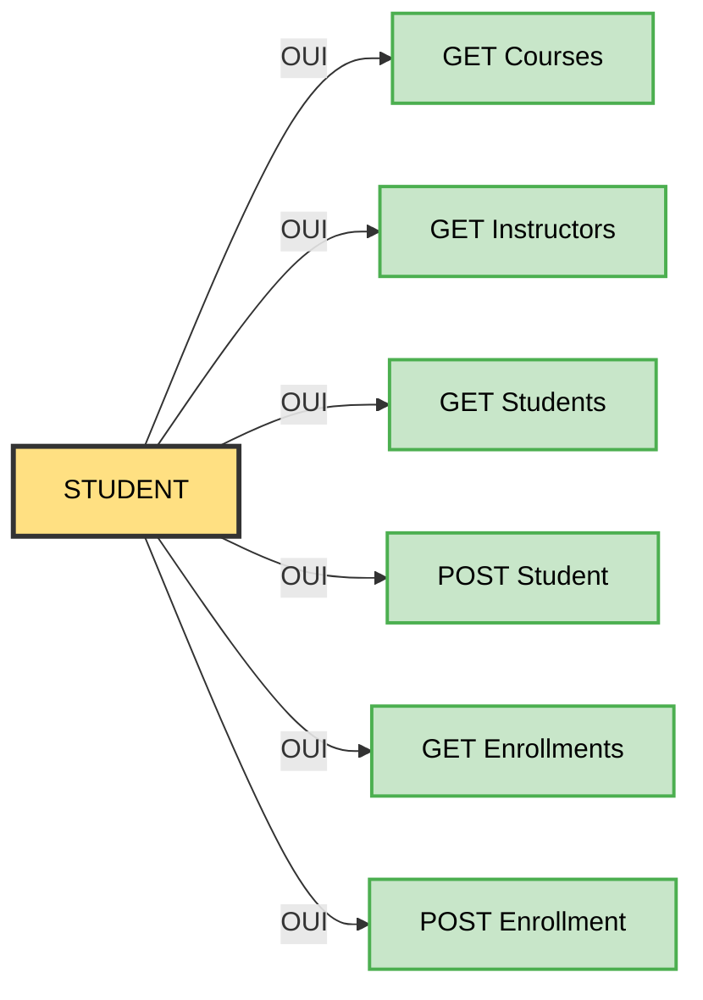
```mermaid
graph LR
    Student["STUDENT"]
    
    Student -->|OUI| CGet["GET Courses"]
    Student -->|OUI| IGet["GET Instructors"]
    Student -->|OUI| StGet["GET Students"]
    Student -->|OUI| StPost["POST Student"]
    Student -->|OUI| EGet["GET Enrollments"]
    Student -->|OUI| EPost["POST Enrollment"]
    
    style Student fill:#FFE082,color:#000,stroke:#333,stroke-width:3px
    style CGet fill:#C8E6C9,color:#000,stroke:#4CAF50,stroke-width:2px
    style IGet fill:#C8E6C9,color:#000,stroke:#4CAF50,stroke-width:2px
    style StGet fill:#C8E6C9,color:#000,stroke:#4CAF50,stroke-width:2px
    style StPost fill:#C8E6C9,color:#000,stroke:#4CAF50,stroke-width:2px
    style EGet fill:#C8E6C9,color:#000,stroke:#4CAF50,stroke-width:2px
    style EPost fill:#C8E6C9,color:#000,stroke:#4CAF50,stroke-width:2px
```

**INSTRUCTOR - Ce qu'il peut faire EN PLUS :**

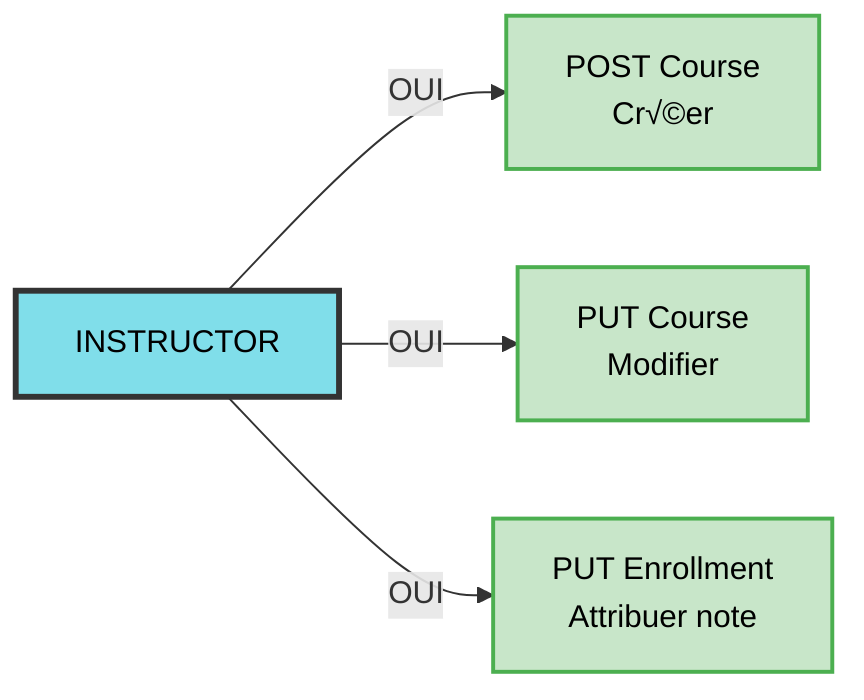
```mermaid
graph LR
    Instructor["INSTRUCTOR"]
    
    Instructor -->|OUI| CPost["POST Course<br/>Créer"]
    Instructor -->|OUI| CPut["PUT Course<br/>Modifier"]
    Instructor -->|OUI| EPut["PUT Enrollment<br/>Attribuer note"]
    
    style Instructor fill:#80DEEA,color:#000,stroke:#333,stroke-width:3px
    style CPost fill:#C8E6C9,color:#000,stroke:#4CAF50,stroke-width:2px
    style CPut fill:#C8E6C9,color:#000,stroke:#4CAF50,stroke-width:2px
    style EPut fill:#C8E6C9,color:#000,stroke:#4CAF50,stroke-width:2px
```

**ADMIN - Ce qu'il peut faire EN PLUS :**

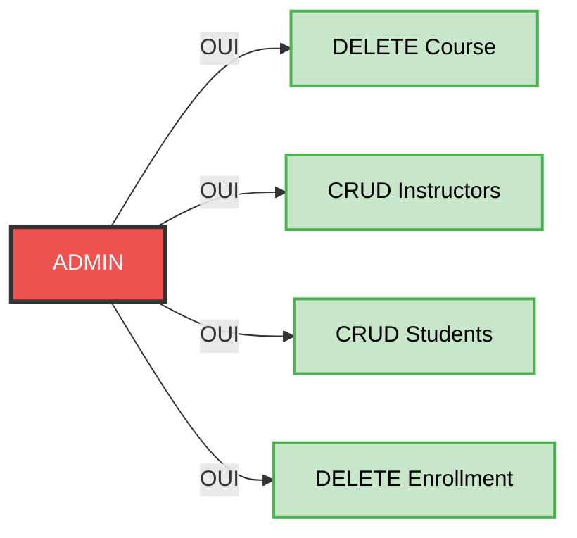
```mermaid
graph LR
    Admin["ADMIN"]
    
    Admin -->|OUI| CDel["DELETE Course"]
    Admin -->|OUI| IAll["CRUD Instructors"]
    Admin -->|OUI| StAll["CRUD Students"]
    Admin -->|OUI| EDel["DELETE Enrollment"]
    
    style Admin fill:#EF5350,color:#fff,stroke:#333,stroke-width:3px
    style CDel fill:#C8E6C9,color:#000,stroke:#4CAF50,stroke-width:2px
    style IAll fill:#C8E6C9,color:#000,stroke:#4CAF50,stroke-width:2px
    style StAll fill:#C8E6C9,color:#000,stroke:#4CAF50,stroke-width:2px
    style EDel fill:#C8E6C9,color:#000,stroke:#4CAF50,stroke-width:2px
```

---

## Règles de Validation (FluentValidation)

### 1. CourseRequestValidator

```csharp
public class CourseRequestValidator : AbstractValidator<CourseRequest>
{
    public CourseRequestValidator()
    {
        RuleFor(x => x.Title)
            .NotEmpty().WithMessage("Le titre est obligatoire.")
            .MinimumLength(5).WithMessage("Le titre doit contenir au moins 5 caractères.")
            .MaximumLength(100).WithMessage("Le titre ne peut pas dépasser 100 caractères.");
        
        RuleFor(x => x.Description)
            .NotEmpty().WithMessage("La description est obligatoire.")
            .MinimumLength(10).WithMessage("La description doit contenir au moins 10 caractères.")
            .MaximumLength(500).WithMessage("La description ne peut pas dépasser 500 caractères.");
        
        RuleFor(x => x.Duration)
            .GreaterThanOrEqualTo(1).WithMessage("La durée doit être au moins 1 heure.")
            .LessThanOrEqualTo(200).WithMessage("La durée ne peut pas dépasser 200 heures.");
        
        RuleFor(x => x.MaxStudents)
            .GreaterThanOrEqualTo(5).WithMessage("Le nombre maximum d'étudiants doit être au moins 5.")
            .LessThanOrEqualTo(100).WithMessage("Le nombre maximum d'étudiants ne peut pas dépasser 100.");
        
        RuleFor(x => x.Price)
            .GreaterThanOrEqualTo(0).WithMessage("Le prix ne peut pas être négatif.")
            .LessThanOrEqualTo(10000).WithMessage("Le prix ne peut pas dépasser 10 000.");
        
        RuleFor(x => x.Level)
            .NotEmpty().WithMessage("Le niveau est obligatoire.")
            .Must(x => x == "Beginner" || x == "Intermediate" || x == "Advanced")
            .WithMessage("Le niveau doit être 'Beginner', 'Intermediate' ou 'Advanced'.");
        
        RuleFor(x => x.InstructorId)
            .NotEmpty().WithMessage("L'identifiant du formateur est obligatoire.");
    }
}
```

### 2. InstructorRequestValidator

```csharp
public class InstructorRequestValidator : AbstractValidator<InstructorRequest>
{
    public InstructorRequestValidator()
    {
        RuleFor(x => x.FirstName)
            .NotEmpty().WithMessage("Le prénom est obligatoire.")
            .MinimumLength(2).WithMessage("Le prénom doit contenir au moins 2 caractères.")
            .MaximumLength(50).WithMessage("Le prénom ne peut pas dépasser 50 caractères.");
        
        RuleFor(x => x.LastName)
            .NotEmpty().WithMessage("Le nom est obligatoire.")
            .MinimumLength(2).WithMessage("Le nom doit contenir au moins 2 caractères.")
            .MaximumLength(50).WithMessage("Le nom ne peut pas dépasser 50 caractères.");
        
        RuleFor(x => x.Specialty)
            .NotEmpty().WithMessage("La spécialité est obligatoire.")
            .MinimumLength(3).WithMessage("La spécialité doit contenir au moins 3 caractères.")
            .MaximumLength(100).WithMessage("La spécialité ne peut pas dépasser 100 caractères.");
        
        RuleFor(x => x.Email)
            .NotEmpty().WithMessage("L'email est obligatoire.")
            .EmailAddress().WithMessage("Le format de l'email est invalide.");
        
        RuleFor(x => x.HireDate)
            .NotEmpty().WithMessage("La date d'embauche est obligatoire.")
            .LessThanOrEqualTo(DateTime.UtcNow).WithMessage("La date d'embauche ne peut pas être dans le futur.");
    }
}
```

### 3. StudentRequestValidator

```csharp
public class StudentRequestValidator : AbstractValidator<StudentRequest>
{
    public StudentRequestValidator()
    {
        RuleFor(x => x.FirstName)
            .NotEmpty().WithMessage("Le prénom est obligatoire.")
            .MinimumLength(2).WithMessage("Le prénom doit contenir au moins 2 caractères.")
            .MaximumLength(50).WithMessage("Le prénom ne peut pas dépasser 50 caractères.");
        
        RuleFor(x => x.LastName)
            .NotEmpty().WithMessage("Le nom est obligatoire.")
            .MinimumLength(2).WithMessage("Le nom doit contenir au moins 2 caractères.")
            .MaximumLength(50).WithMessage("Le nom ne peut pas dépasser 50 caractères.");
        
        RuleFor(x => x.Email)
            .NotEmpty().WithMessage("L'email est obligatoire.")
            .EmailAddress().WithMessage("Le format de l'email est invalide.");
        
        RuleFor(x => x.RegistrationDate)
            .NotEmpty().WithMessage("La date d'inscription est obligatoire.")
            .LessThanOrEqualTo(DateTime.UtcNow).WithMessage("La date d'inscription ne peut pas être dans le futur.");
        
        RuleFor(x => x.Level)
            .NotEmpty().WithMessage("Le niveau est obligatoire.")
            .Must(x => x == "Beginner" || x == "Intermediate" || x == "Advanced")
            .WithMessage("Le niveau doit être 'Beginner', 'Intermediate' ou 'Advanced'.");
    }
}
```

### 4. EnrollmentRequestValidator

```csharp
public class EnrollmentRequestValidator : AbstractValidator<EnrollmentRequest>
{
    public EnrollmentRequestValidator()
    {
        RuleFor(x => x.CourseId)
            .NotEmpty().WithMessage("L'identifiant du cours est obligatoire.");
        
        RuleFor(x => x.StudentId)
            .NotEmpty().WithMessage("L'identifiant de l'étudiant est obligatoire.");
        
        RuleFor(x => x.Status)
            .Must(x => x == "Active" || x == "Completed" || x == "Cancelled")
            .When(x => !string.IsNullOrEmpty(x.Status))
            .WithMessage("Le statut doit être 'Active', 'Completed' ou 'Cancelled'.");
        
        RuleFor(x => x.Grade)
            .GreaterThanOrEqualTo(0).WithMessage("La note ne peut pas être négative.")
            .LessThanOrEqualTo(100).WithMessage("La note ne peut pas dépasser 100.")
            .When(x => x.Grade.HasValue);
    }
}
```

---

## Endpoints Requis

### Architecture des Endpoints


```mermaid
graph TB
    API["EduTrack API"]
    
    subgraph Auth["Authentification - /api/auth"]
        direction TB
        AuthReg["POST /register"]
        AuthLog["POST /login"]
        AuthVal["POST /validate"]
        AuthMe["GET /me"]
    end
    
    subgraph Courses["Courses - /api/courses"]
        direction TB
        CGet["GET /"]
        CGetId["GET /:id"]
        CPost["POST /"]
        CPut["PUT /:id"]
        CDel["DELETE /:id"]
    end
    
    subgraph Instructors["Instructors - /api/instructors"]
        direction TB
        IGet["GET /"]
        IGetId["GET /:id"]
        IPost["POST /"]
        IPut["PUT /:id"]
        IDel["DELETE /:id"]
    end
    
    subgraph Students["Students - /api/students"]
        direction TB
        StGet["GET /"]
        StGetId["GET /:id"]
        StPost["POST /"]
        StPut["PUT /:id"]
        StDel["DELETE /:id"]
    end
    
    subgraph Enrollments["Enrollments - /api/enrollments"]
        direction TB
        EGet["GET /"]
        EGetId["GET /:id"]
        EPost["POST /"]
        EPut["PUT /:id"]
        EDel["DELETE /:id"]
    end
    
    Health["GET /health"]
    
    API --> Auth
    API --> Courses
    API --> Instructors
    API --> Students
    API --> Enrollments
    API --> Health
    
    style API fill:#4CAF50,color:#fff,stroke:#333,stroke-width:3px
    style Auth fill:#FF9800,color:#fff,stroke:#333,stroke-width:2px
    style Courses fill:#2196F3,color:#fff,stroke:#333,stroke-width:2px
    style Instructors fill:#FFC107,color:#000,stroke:#333,stroke-width:2px
    style Students fill:#9C27B0,color:#fff,stroke:#333,stroke-width:2px
    style Enrollments fill:#4CAF50,color:#fff,stroke:#333,stroke-width:2px
    style Health fill:#00BCD4,color:#fff,stroke:#333,stroke-width:2px
```

**Version Verticale par Ressource (Alternative 1) :**

**COURSES (5 endpoints) :**
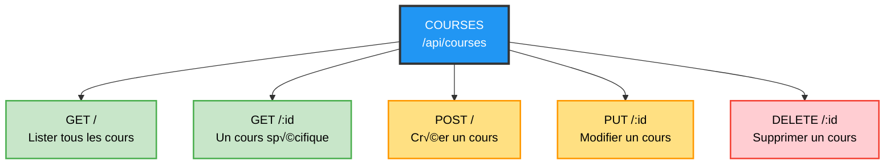
```mermaid
graph TB
    CoursesAPI["COURSES<br/>/api/courses"]
    
    CoursesAPI --> CGet["GET /<br/>Lister tous les cours"]
    CoursesAPI --> CGetId["GET /:id<br/>Un cours spécifique"]
    CoursesAPI --> CPost["POST /<br/>Créer un cours"]
    CoursesAPI --> CPut["PUT /:id<br/>Modifier un cours"]
    CoursesAPI --> CDel["DELETE /:id<br/>Supprimer un cours"]
    
    style CoursesAPI fill:#2196F3,color:#fff,stroke:#333,stroke-width:3px
    style CGet fill:#C8E6C9,color:#000,stroke:#4CAF50,stroke-width:2px
    style CGetId fill:#C8E6C9,color:#000,stroke:#4CAF50,stroke-width:2px
    style CPost fill:#FFE082,color:#000,stroke:#FF9800,stroke-width:2px
    style CPut fill:#FFE082,color:#000,stroke:#FF9800,stroke-width:2px
    style CDel fill:#FFCDD2,color:#000,stroke:#F44336,stroke-width:2px
```

**INSTRUCTORS (5 endpoints) :**
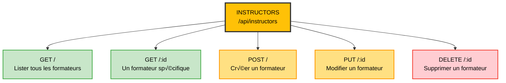
```mermaid
graph TB
    InstAPI["INSTRUCTORS<br/>/api/instructors"]
    
    InstAPI --> IGet["GET /<br/>Lister tous les formateurs"]
    InstAPI --> IGetId["GET /:id<br/>Un formateur spécifique"]
    InstAPI --> IPost["POST /<br/>Créer un formateur"]
    InstAPI --> IPut["PUT /:id<br/>Modifier un formateur"]
    InstAPI --> IDel["DELETE /:id<br/>Supprimer un formateur"]
    
    style InstAPI fill:#FFC107,color:#000,stroke:#333,stroke-width:3px
    style IGet fill:#C8E6C9,color:#000,stroke:#4CAF50,stroke-width:2px
    style IGetId fill:#C8E6C9,color:#000,stroke:#4CAF50,stroke-width:2px
    style IPost fill:#FFE082,color:#000,stroke:#FF9800,stroke-width:2px
    style IPut fill:#FFE082,color:#000,stroke:#FF9800,stroke-width:2px
    style IDel fill:#FFCDD2,color:#000,stroke:#F44336,stroke-width:2px
```

**STUDENTS (5 endpoints) :**
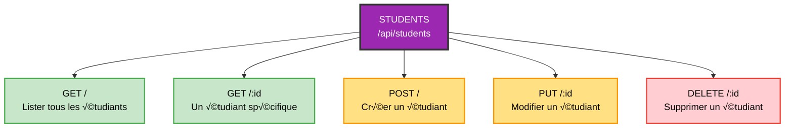
```mermaid
graph TB
    StudAPI["STUDENTS<br/>/api/students"]
    
    StudAPI --> SGet["GET /<br/>Lister tous les étudiants"]
    StudAPI --> SGetId["GET /:id<br/>Un étudiant spécifique"]
    StudAPI --> SPost["POST /<br/>Créer un étudiant"]
    StudAPI --> SPut["PUT /:id<br/>Modifier un étudiant"]
    StudAPI --> SDel["DELETE /:id<br/>Supprimer un étudiant"]
    
    style StudAPI fill:#9C27B0,color:#fff,stroke:#333,stroke-width:3px
    style SGet fill:#C8E6C9,color:#000,stroke:#4CAF50,stroke-width:2px
    style SGetId fill:#C8E6C9,color:#000,stroke:#4CAF50,stroke-width:2px
    style SPost fill:#FFE082,color:#000,stroke:#FF9800,stroke-width:2px
    style SPut fill:#FFE082,color:#000,stroke:#FF9800,stroke-width:2px
    style SDel fill:#FFCDD2,color:#000,stroke:#F44336,stroke-width:2px
```

**ENROLLMENTS (5 endpoints) :**
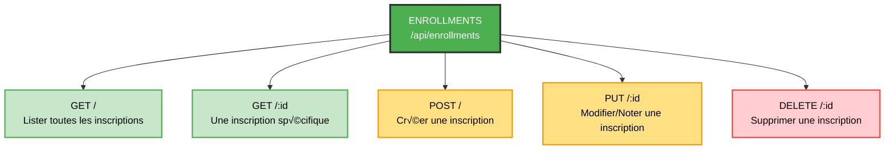
```mermaid
graph TB
    EnrAPI["ENROLLMENTS<br/>/api/enrollments"]
    
    EnrAPI --> EGet["GET /<br/>Lister toutes les inscriptions"]
    EnrAPI --> EGetId["GET /:id<br/>Une inscription spécifique"]
    EnrAPI --> EPost["POST /<br/>Créer une inscription"]
    EnrAPI --> EPut["PUT /:id<br/>Modifier/Noter une inscription"]
    EnrAPI --> EDel["DELETE /:id<br/>Supprimer une inscription"]
    
    style EnrAPI fill:#4CAF50,color:#fff,stroke:#333,stroke-width:3px
    style EGet fill:#C8E6C9,color:#000,stroke:#4CAF50,stroke-width:2px
    style EGetId fill:#C8E6C9,color:#000,stroke:#4CAF50,stroke-width:2px
    style EPost fill:#FFE082,color:#000,stroke:#FF9800,stroke-width:2px
    style EPut fill:#FFE082,color:#000,stroke:#FF9800,stroke-width:2px
    style EDel fill:#FFCDD2,color:#000,stroke:#F44336,stroke-width:2px
```

**Légende des Couleurs :**
- 🟢 **Vert** : GET (lecture) - Accessible à tous
- 🟡 **Jaune** : POST/PUT (création/modification) - Nécessite permissions
- 🔴 **Rouge** : DELETE (suppression) - Admin seulement

---

**Résumé Textuel des Endpoints :**

```
1. COURSES (/api/courses)
   ├── GET /                Lister tous les cours
   ├── GET /:id             Récupérer un cours spécifique
   ├── POST /               Créer un nouveau cours
   ├── PUT /:id             Modifier un cours
   └── DELETE /:id          Supprimer un cours

2. INSTRUCTORS (/api/instructors)
   ├── GET /                Lister tous les formateurs
   ├── GET /:id             Récupérer un formateur spécifique
   ├── POST /               Créer un nouveau formateur
   ├── PUT /:id             Modifier un formateur
   └── DELETE /:id          Supprimer un formateur

3. STUDENTS (/api/students)
   ├── GET /                Lister tous les étudiants
   ├── GET /:id             Récupérer un étudiant spécifique
   ├── POST /               Créer un nouveau étudiant
   ├── PUT /:id             Modifier un étudiant
   └── DELETE /:id          Supprimer un étudiant

4. ENROLLMENTS (/api/enrollments)
   ├── GET /                Lister toutes les inscriptions
   ├── GET /:id             Récupérer une inscription spécifique
   ├── POST /               Créer une nouvelle inscription
   ├── PUT /:id             Modifier une inscription (attribuer note)
   └── DELETE /:id          Supprimer une inscription

5. AUTHENTIFICATION (/api/auth)
   ├── POST /register       Inscription d'un nouvel utilisateur
   ├── POST /login          Connexion utilisateur
   ├── POST /validate       Valider un token JWT
   └── GET /me              Profil de l'utilisateur connecté

6. HEALTH CHECK
   └── GET /health          Vérifier le statut de l'API
```

**TOTAL : 26 endpoints**

---

**Version Compacte par Catégorie (Alternative 2) :**

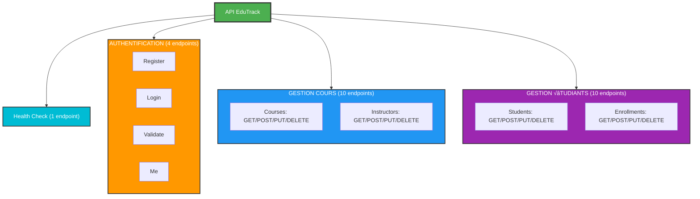
```mermaid
graph TB
    Start["API EduTrack"]
    
    Start --> Cat1
    Start --> Cat2
    Start --> Cat3
    
    subgraph Cat1["AUTHENTIFICATION (4 endpoints)"]
        direction LR
        Auth1["Register"]
        Auth2["Login"]
        Auth3["Validate"]
        Auth4["Me"]
    end
    
    subgraph Cat2["GESTION COURS (10 endpoints)"]
        direction TB
        G1["Courses: GET/POST/PUT/DELETE"]
        G2["Instructors: GET/POST/PUT/DELETE"]
    end
    
    subgraph Cat3["GESTION ÉTUDIANTS (10 endpoints)"]
        direction TB
        G3["Students: GET/POST/PUT/DELETE"]
        G4["Enrollments: GET/POST/PUT/DELETE"]
    end
    
    Health["Health Check (1 endpoint)"]
    Start --> Health
    
    style Start fill:#4CAF50,color:#fff,stroke:#333,stroke-width:3px
    style Cat1 fill:#FF9800,color:#fff,stroke:#333,stroke-width:2px
    style Cat2 fill:#2196F3,color:#fff,stroke:#333,stroke-width:2px
    style Cat3 fill:#9C27B0,color:#fff,stroke:#333,stroke-width:2px
    style Health fill:#00BCD4,color:#fff,stroke:#333,stroke-width:2px
```

### Liste Détaillée des Endpoints

#### Authentification (`/api/auth`)

1. **POST /api/auth/register** - Inscription
2. **POST /api/auth/login** - Connexion
3. **POST /api/auth/validate** - Valider un token
4. **GET /api/auth/me** - Profil utilisateur connecté

#### Courses (`/api/courses`)

1. **GET /api/courses** - Lister tous les cours
2. **GET /api/courses/{id}** - Récupérer un cours
3. **POST /api/courses** - Créer un cours
4. **PUT /api/courses/{id}** - Modifier un cours
5. **DELETE /api/courses/{id}** - Supprimer un cours

#### Instructors (`/api/instructors`)

1. **GET /api/instructors** - Lister tous les formateurs
2. **GET /api/instructors/{id}** - Récupérer un formateur
3. **POST /api/instructors** - Créer un formateur
4. **PUT /api/instructors/{id}** - Modifier un formateur
5. **DELETE /api/instructors/{id}** - Supprimer un formateur

#### Students (`/api/students`)

1. **GET /api/students** - Lister tous les étudiants
2. **GET /api/students/{id}** - Récupérer un étudiant
3. **POST /api/students** - Créer un étudiant
4. **PUT /api/students/{id}** - Modifier un étudiant
5. **DELETE /api/students/{id}** - Supprimer un étudiant

#### Enrollments (`/api/enrollments`)

1. **GET /api/enrollments** - Lister toutes les inscriptions
2. **GET /api/enrollments/{id}** - Récupérer une inscription
3. **POST /api/enrollments** - Créer une inscription
4. **PUT /api/enrollments/{id}** - Modifier une inscription (note, statut)
5. **DELETE /api/enrollments/{id}** - Supprimer une inscription

#### Health Check

1. **GET /health** - Vérifier le statut de l'API

**TOTAL : 26 endpoints**

---

## Configuration Technique

### appsettings.json

```json
{
  "ConnectionStrings": {
    "EduTrack": "Server=VOTRE_SERVEUR;Database=EduTrack;Trusted_Connection=True;Encrypt=True;TrustServerCertificate=True"
  },
  "Jwt": {
    "Issuer": "EduTrackAPI",
    "Audience": "EduTrackClients",
    "Key": "VotreCléSecrèteTrèsLongueEtComplexePourEduTrack123456789!"
  },
  "Serilog": {
    "MinimumLevel": {
      "Default": "Information",
      "Override": {
        "Microsoft": "Warning",
        "Microsoft.Hosting.Lifetime": "Information"
      }
    },
    "WriteTo": [
      { "Name": "Console" },
      {
        "Name": "File",
        "Args": {
          "path": "logs/edutrack-.txt",
          "rollingInterval": "Day",
          "retainedFileCountLimit": 30
        }
      }
    ],
    "Enrich": ["FromLogContext", "WithMachineName", "WithThreadId"]
  }
}
```

### Packages NuGet Requis

```xml
<PackageReference Include="BCrypt.Net-Next" Version="4.0.3" />
<PackageReference Include="FluentValidation.AspNetCore" Version="11.3.0" />
<PackageReference Include="Microsoft.AspNetCore.Authentication.JwtBearer" Version="8.0.0" />
<PackageReference Include="Microsoft.EntityFrameworkCore.Design" Version="8.0.0" />
<PackageReference Include="Microsoft.EntityFrameworkCore.SqlServer" Version="8.0.0" />
<PackageReference Include="Microsoft.EntityFrameworkCore.Tools" Version="8.0.0" />
<PackageReference Include="Microsoft.Extensions.Diagnostics.HealthChecks.EntityFrameworkCore" Version="8.0.0" />
<PackageReference Include="Serilog.AspNetCore" Version="8.0.0" />
<PackageReference Include="Serilog.Sinks.Console" Version="5.0.0" />
<PackageReference Include="Serilog.Sinks.File" Version="5.0.0" />
<PackageReference Include="Swashbuckle.AspNetCore" Version="6.5.0" />
<PackageReference Include="System.IdentityModel.Tokens.Jwt" Version="7.0.3" />
```

---

## Livrables Attendus

### 1. Code Source

Votre projet doit contenir **TOUS** ces dossiers et fichiers :

```
EduTrack/
├── Controllers/
│   ├── AuthController.cs
│   ├── CourseController.cs
│   ├── InstructorController.cs
│   ├── StudentController.cs
│   └── EnrollmentController.cs
│
├── Entities/
│   ├── User.cs
│   ├── Course.cs
│   ├── Instructor.cs
│   ├── Student.cs
│   └── Enrollment.cs
│
├── Repositories/
│   ├── EduTrackContext.cs
│   ├── UserRepository.cs
│   ├── CourseRepository.cs
│   ├── InstructorRepository.cs
│   ├── StudentRepository.cs
│   └── EnrollmentRepository.cs
│
├── Services/
│   ├── AuthService.cs
│   ├── CourseService.cs
│   ├── InstructorService.cs
│   ├── StudentService.cs
│   └── EnrollmentService.cs
│
├── Requests/
│   ├── RegisterRequest.cs
│   ├── LoginRequest.cs
│   ├── CourseRequest.cs
│   ├── InstructorRequest.cs
│   ├── StudentRequest.cs
│   └── EnrollmentRequest.cs
│
├── Responses/
│   ├── AuthResponse.cs
│   ├── CourseResponse.cs
│   ├── InstructorResponse.cs
│   ├── StudentResponse.cs
│   └── EnrollmentResponse.cs
│
├── Validators/
│   ├── CourseRequestValidator.cs
│   ├── InstructorRequestValidator.cs
│   ├── StudentRequestValidator.cs
│   └── EnrollmentRequestValidator.cs
│
├── Exceptions/
│   └── NotFoundException.cs
│
├── appsettings.json
├── appsettings.Production.json
├── Program.cs
└── EduTrack.csproj
```

### 2. Base de Données

La base de données **EduTrack** doit être créée automatiquement par Entity Framework avec :
- Table Users
- Table Instructors
- Table Courses
- Table Students
- Table Enrollments

### 3. Documentation

- **README.md** : Instructions de démarrage
- **Swagger** fonctionnel sur `https://localhost:7033/swagger`

---

## Grille de Notation

### Partie 1 : Architecture et Entités (35 points)

| Critère | Points | Détails |
|---------|--------|---------|
| **Entités** | 10 | Toutes les entités créées avec les bonnes propriétés |
| **DbContext** | 5 | XtraWorkContext avec DbSet et relations |
| **Repositories** | 10 | Tous les repositories avec méthodes CRUD |
| **Services** | 10 | Tous les services avec logique métier |

**Vérification :**
- Toutes les entités ont des propriétés Guid Id
- Les relations sont bien configurées (HasOne, WithMany)
- Les repositories utilisent async/await
- Les services retournent des Response objects

### Partie 2 : Authentification et Autorisation (30 points)

| Critère | Points | Détails |
|---------|--------|---------|
| **JWT** | 10 | Configuration JWT complète dans Program.cs |
| **BCrypt** | 5 | Hachage des mots de passe |
| **AuthService** | 5 | Méthodes Register, Login, Validate |
| **Policies** | 10 | Policies "StudentOnly", "InstructorOrAdmin", "AdminOnly" |

**Vérification :**
- Les tokens sont générés avec les bonnes claims (role, username)
- Les mots de passe sont hachés avec BCrypt
- Les policies sont appliquées sur les controllers avec [Authorize(Policy = "...")]
- Un Student ne peut pas accéder aux endpoints Instructor

### Partie 3 : Validation (15 points)

| Critère | Points | Détails |
|---------|--------|---------|
| **FluentValidation** | 8 | Tous les validators créés |
| **Messages personnalisés** | 4 | Messages en français clairs |
| **Règles complexes** | 3 | Must, GreaterThan, Email, etc. |

**Vérification :**
- CourseRequestValidator avec règles sur Duration, Price, Level
- InstructorRequestValidator avec règle sur HireDate
- StudentRequestValidator avec règle sur Level
- EnrollmentRequestValidator avec règle sur Grade

### Partie 4 : Controllers et Endpoints (20 points)

| Critère | Points | Détails |
|---------|--------|---------|
| **CourseController** | 5 | CRUD complet avec autorisations |
| **InstructorController** | 5 | CRUD complet avec autorisations |
| **StudentController** | 3 | CRUD complet avec autorisations |
| **EnrollmentController** | 5 | CRUD complet avec autorisations |
| **AuthController** | 2 | Register, Login, Validate, Me |

**Vérification :**
- Tous les endpoints retournent les bons codes HTTP
- Les autorisations sont correctement appliquées
- Les méthodes utilisent async/await
- Les réponses sont sous forme de Response objects

---

## Données de Test à Créer

### 3 Utilisateurs

```json
{
  "username": "alice.student",
  "email": "alice@edutrack.com",
  "password": "Alice123!",
  "firstName": "Alice",
  "lastName": "Martin"
}
```

```json
{
  "username": "bob.instructor",
  "email": "bob@edutrack.com",
  "password": "Bob123!",
  "firstName": "Bob",
  "lastName": "Dupont"
}
```

```json
{
  "username": "admin",
  "email": "admin@edutrack.com",
  "password": "Admin123!",
  "firstName": "Admin",
  "lastName": "System"
}
```

**Ensuite, changer les rôles via SQL :**
```sql
USE EduTrack;
UPDATE Users SET Role = 'Instructor' WHERE Username = 'bob.instructor';
UPDATE Users SET Role = 'Admin' WHERE Username = 'admin';
```

### 3 Instructors

```json
{
  "firstName": "Marie",
  "lastName": "Curie",
  "specialty": "Physique et Chimie",
  "email": "marie.curie@edutrack.com",
  "hireDate": "2020-09-01"
}
```

```json
{
  "firstName": "Albert",
  "lastName": "Einstein",
  "specialty": "Mathématiques et Physique",
  "email": "albert.einstein@edutrack.com",
  "hireDate": "2021-01-15"
}
```

```json
{
  "firstName": "Ada",
  "lastName": "Lovelace",
  "specialty": "Informatique et Programmation",
  "email": "ada.lovelace@edutrack.com",
  "hireDate": "2019-08-20"
}
```

### 5 Courses

```json
{
  "title": "Introduction à C#",
  "description": "Apprendre les bases du langage C# et de la programmation orientée objet.",
  "instructorId": "ID_ADA_LOVELACE",
  "duration": 40,
  "maxStudents": 30,
  "price": 299.99,
  "level": "Beginner"
}
```

```json
{
  "title": "ASP.NET Core Avancé",
  "description": "Maîtriser le développement d'API REST avec ASP.NET Core et Entity Framework.",
  "instructorId": "ID_ADA_LOVELACE",
  "duration": 60,
  "maxStudents": 25,
  "price": 499.99,
  "level": "Advanced"
}
```

```json
{
  "title": "Physique Quantique",
  "description": "Comprendre les principes fondamentaux de la mécanique quantique.",
  "instructorId": "ID_MARIE_CURIE",
  "duration": 80,
  "maxStudents": 20,
  "price": 599.99,
  "level": "Advanced"
}
```

```json
{
  "title": "Mathématiques pour l'Informatique",
  "description": "Algèbre linéaire, calcul différentiel et probabilités appliquées.",
  "instructorId": "ID_ALBERT_EINSTEIN",
  "duration": 50,
  "maxStudents": 35,
  "price": 349.99,
  "level": "Intermediate"
}
```

```json
{
  "title": "Introduction à la Programmation",
  "description": "Premiers pas dans le monde de la programmation avec Python.",
  "instructorId": "ID_ADA_LOVELACE",
  "duration": 30,
  "maxStudents": 50,
  "price": 199.99,
  "level": "Beginner"
}
```

### 5 Students

```json
{
  "firstName": "Pierre",
  "lastName": "Durand",
  "email": "pierre.durand@student.com",
  "registrationDate": "2025-01-10",
  "level": "Beginner"
}
```

```json
{
  "firstName": "Sophie",
  "lastName": "Bernard",
  "email": "sophie.bernard@student.com",
  "registrationDate": "2025-02-15",
  "level": "Intermediate"
}
```

```json
{
  "firstName": "Lucas",
  "lastName": "Moreau",
  "email": "lucas.moreau@student.com",
  "registrationDate": "2025-01-20",
  "level": "Advanced"
}
```

```json
{
  "firstName": "Emma",
  "lastName": "Leroy",
  "email": "emma.leroy@student.com",
  "registrationDate": "2025-03-01",
  "level": "Beginner"
}
```

```json
{
  "firstName": "Thomas",
  "lastName": "Petit",
  "email": "thomas.petit@student.com",
  "registrationDate": "2025-02-10",
  "level": "Intermediate"
}
```

### 8 Enrollments

```json
{
  "courseId": "ID_INTRO_CSHARP",
  "studentId": "ID_PIERRE",
  "status": "Active"
}
```

```json
{
  "courseId": "ID_ASPNET_AVANCE",
  "studentId": "ID_LUCAS",
  "status": "Active"
}
```

```json
{
  "courseId": "ID_PHYSIQUE_QUANTIQUE",
  "studentId": "ID_LUCAS",
  "status": "Completed",
  "grade": 85.5
}
```

```json
{
  "courseId": "ID_MATHS_INFO",
  "studentId": "ID_SOPHIE",
  "status": "Active"
}
```

```json
{
  "courseId": "ID_INTRO_PROGRAMMATION",
  "studentId": "ID_PIERRE",
  "status": "Completed",
  "grade": 92.0
}
```

```json
{
  "courseId": "ID_INTRO_PROGRAMMATION",
  "studentId": "ID_EMMA",
  "status": "Active"
}
```

```json
{
  "courseId": "ID_INTRO_CSHARP",
  "studentId": "ID_THOMAS",
  "status": "Cancelled"
}
```

```json
{
  "courseId": "ID_MATHS_INFO",
  "studentId": "ID_LUCAS",
  "status": "Completed",
  "grade": 78.0
}
```

---

## Tests à Réaliser dans Swagger

### Tests STUDENT (12 tests minimum)

#### Tests Autorisés (doivent réussir)

1. ‚úÖ Inscription (POST /auth/register)
2. ‚úÖ Connexion (POST /auth/login)
3. ‚úÖ Profil (GET /auth/me)
4. ‚úÖ Lire courses (GET /courses)
5. ‚úÖ Lire un course (GET /courses/{id})
6. ‚úÖ Lire instructors (GET /instructors)
7. ✅ Créer student (POST /students)
8. ✅ S'inscrire à un cours (POST /enrollments)
9. ‚úÖ Voir ses inscriptions (GET /enrollments)

#### Tests Interdits (doivent échouer avec 403)

10. ❌ Créer course (POST /courses) - Attendu : 403
11. ‚ùå Modifier course (PUT /courses/{id}) - Attendu : 403
12. ‚ùå Supprimer course (DELETE /courses/{id}) - Attendu : 403

### Tests INSTRUCTOR (15 tests minimum)

#### Tests Autorisés

1. ‚úÖ Inscription et connexion
2. ‚úÖ Lire courses
3. ✅ Créer course (POST /courses)
4. ‚úÖ Modifier course (PUT /courses/{id})
5. ‚úÖ Lire instructors
6. ‚úÖ Lire students
7. ✅ Créer student (POST /students)
8. ‚úÖ Lire enrollments
9. ✅ Créer enrollment (POST /enrollments)
10. ‚úÖ Modifier enrollment - attribuer note (PUT /enrollments/{id})

#### Tests Interdits

11. ‚ùå Supprimer course - Attendu : 403
12. ❌ Créer instructor - Attendu : 403
13. ‚ùå Modifier instructor - Attendu : 403
14. ‚ùå Modifier student - Attendu : 403
15. ‚ùå Supprimer enrollment - Attendu : 403

### Tests ADMIN (25+ tests)

#### Tests CRUD Complets

1. ‚úÖ CRUD complet sur Courses (5 tests)
2. ‚úÖ CRUD complet sur Instructors (5 tests)
3. ‚úÖ CRUD complet sur Students (5 tests)
4. ‚úÖ CRUD complet sur Enrollments (5 tests)

#### Tests de Validation (6 tests)

5. ‚ùå Course titre trop court - Attendu : 400
6. ‚ùå Course duration invalide (0 ou > 200) - Attendu : 400
7. ❌ Course price négative - Attendu : 400
8. ‚ùå Course level invalide - Attendu : 400
9. ‚ùå Enrollment grade > 100 - Attendu : 400
10. ‚ùå Instructor hireDate future - Attendu : 400

---

## Consignes Techniques

### 1. Configuration de l'Authentification

Dans `Program.cs`, configurer JWT avec :
- Issuer : "EduTrackAPI"
- Audience : "EduTrackClients"
- Durée du token : 1 heure
- Claims : Id, Username, Role

### 2. Policies d'Autorisation

Créer 3 policies :

```csharp
builder.Services.AddAuthorization(options =>
{
    options.AddPolicy("StudentOnly", p => p.RequireRole("Student"));
    options.AddPolicy("InstructorOrAdmin", p => p.RequireRole("Instructor", "Admin"));
    options.AddPolicy("AdminOnly", p => p.RequireRole("Admin"));
});
```

### 3. Application des Policies sur Controllers

**CourseController :**
- GET : Tous les rôles
- POST : [Authorize(Policy = "InstructorOrAdmin")]
- PUT : [Authorize(Policy = "InstructorOrAdmin")]
- DELETE : [Authorize(Policy = "AdminOnly")]

**InstructorController :**
- GET : Tous les rôles
- POST/PUT/DELETE : [Authorize(Policy = "AdminOnly")]

**StudentController :**
- GET : Tous les rôles
- POST : [Authorize(Policy = "InstructorOrAdmin")]
- PUT/DELETE : [Authorize(Policy = "AdminOnly")]

**EnrollmentController :**
- GET : Tous les rôles
- POST : Tous les rôles authentifiés
- PUT : [Authorize(Policy = "InstructorOrAdmin")]
- DELETE : [Authorize(Policy = "AdminOnly")]

### 4. Propriétés Calculées

**CourseResponse** doit contenir :
- `InstructorFullName` (concaténation FirstName + LastName)
- `AvailableSeats` (MaxStudents - nombre d'enrollments actifs)

**EnrollmentResponse** doit contenir :
- `CourseTitle` (titre du cours)
- `StudentFullName` (nom complet de l'étudiant)
- `InstructorName` (nom du formateur du cours)

### 5. Health Check

Configurer un health check sur `/health` qui vérifie :
- La connexion à la base de données
- Le statut "Healthy" si OK

---

## Critères de Réussite

### Minimum Requis (50/100)

- ‚úÖ Projet compile sans erreur
- ✅ API démarre correctement
- ✅ Base de données créée automatiquement
- ✅ Au moins 2 entités fonctionnelles
- ‚úÖ Authentification JWT basique
- ‚úÖ Au moins 10 endpoints fonctionnels

### Bon Niveau (70/100)

- ✅ Toutes les entités créées
- ‚úÖ Tous les endpoints fonctionnels
- ✅ Authentification JWT complète
- ✅ Au moins 2 rôles fonctionnels
- ‚úÖ Validation de base

### Excellent (90+/100)

- ‚úÖ Architecture parfaite
- ✅ 3 rôles avec toutes les autorisations
- ✅ FluentValidation complète
- ✅ Tous les tests Swagger réussis
- ✅ Code propre et bien structuré
- ✅ Gestion d'erreurs complète
- ✅ Logs Serilog configurés

---

## Interdictions et Contraintes

### Interdictions

❌ Utiliser des bibliothèques non autorisées  
‚ùå Copier-coller du code sans comprendre  
❌ Travailler en équipe (examen individuel)  
‚ùå Utiliser Database First (obligatoire : Code First)  

### Contraintes

‚úÖ Utiliser .NET 8.0  
‚úÖ Utiliser Entity Framework Core  
‚úÖ Utiliser SQL Server (pas SQLite)  
✅ Tous les IDs doivent être de type `Guid`  
✅ Toutes les méthodes async/await  
✅ Messages de validation en français  

---

## Procédure de Rendu

### 1. Code Source

Compresser le dossier `EduTrack/` en **ZIP** :
- Nom du fichier : `NOM_Prenom_EduTrack.zip`
- Exclure les dossiers `bin/`, `obj/`, `logs/`

### 2. Documentation

Inclure dans le ZIP :
- `README.md` avec instructions de démarrage
- `TESTS_SWAGGER.md` avec captures d'écran des tests réussis

### 3. Base de Données

**Option A :** Inclure un script SQL de création de la base  
**Option B :** Laisser Entity Framework créer automatiquement (recommandé)

### 4. Délai de Rendu

**Date limite :** [À définir par l'enseignant]  
**Pénalité retard :** -5 points par heure

---

## Conseils pour Réussir

### 1. Planification (30 minutes)

- Lire tout l'énoncé
- Créer la structure des dossiers
- Créer les entités
- Dessiner le schéma sur papier

### 2. Développement (2h30)

**Phase 1 : Fondations (1h)**
- Créer les entités
- Créer le DbContext
- Créer les repositories
- Tester la création de la base

**Phase 2 : Logique métier (45 min)**
- Créer les services
- Créer les Request/Response
- Implémenter la logique

**Phase 3 : API et Auth (45 min)**
- Créer les controllers
- Configurer JWT
- Appliquer les policies

### 3. Validation et Tests (45 minutes)

- Créer les validators FluentValidation
- Tester tous les endpoints dans Swagger
- Vérifier les autorisations par rôle

### 4. Finalisation (15 minutes)

- Vérifier les logs
- Tester health check
- Créer le README
- Compresser le projet

---

## Barème Détaillé

### Architecture (35 points)

| Item | Points | Critères |
|------|--------|----------|
| Entities | 10 | 5 entités complètes avec propriétés |
| DbContext | 5 | Configuration correcte avec relations |
| Repositories | 10 | 5 repositories avec méthodes async |
| Services | 10 | 5 services avec logique métier |

### Authentification/Autorisation (30 points)

| Item | Points | Critères |
|------|--------|----------|
| JWT Configuration | 8 | Program.cs avec TokenValidationParameters |
| AuthService | 7 | Register, Login, Validate avec BCrypt |
| Policies | 10 | 3 policies correctement appliquées |
| Tests autorisations | 5 | Vérification 403 pour actions interdites |

### Validation (15 points)

| Item | Points | Critères |
|------|--------|----------|
| Validators | 10 | 4 validators FluentValidation |
| Messages | 3 | Messages en français clairs |
| Tests validation | 2 | Au moins 4 tests 400 réussis |

### Controllers (15 points)

| Item | Points | Critères |
|------|--------|----------|
| CourseController | 4 | CRUD complet |
| InstructorController | 3 | CRUD complet |
| StudentController | 3 | CRUD complet |
| EnrollmentController | 4 | CRUD complet |
| AuthController | 1 | Register, Login, Me, Validate |

### Qualité du Code (5 points)

| Item | Points | Critères |
|------|--------|----------|
| Propreté | 2 | Code lisible, bien indenté |
| Nommage | 1 | Noms explicites en anglais |
| Organisation | 1 | Fichiers bien organisés |
| Documentation | 1 | README clair |

**TOTAL : 100 points**

---

## Guide de Test Swagger - Instructions Étape par Étape

### PRÉPARATION

#### Étape 1 : Démarrer l'API

1. Ouvrir un terminal
2. Naviguer vers le dossier EduTrack
3. Exécuter : `dotnet run`
4. Attendre : `Now listening on: https://localhost:7033`

#### Étape 2 : Ouvrir Swagger

1. Ouvrir un navigateur
2. Aller sur : `https://localhost:7033/swagger/index.html`
3. Vérifier que tous les endpoints sont visibles

#### Étape 3 : Test Health Check

1. Trouver : `GET /health`
2. Try it out > Execute
3. Résultat attendu : 200 - Healthy

---

### PARTIE 1 : Tests STUDENT

#### Test 1.1 : Inscription STUDENT

1. **Endpoint** : `POST /api/Auth/register`
2. **Try it out**
3. **JSON** :

```json
{
  "username": "alice.student",
  "email": "alice@edutrack.com",
  "password": "Alice123!",
  "firstName": "Alice",
  "lastName": "Martin"
}
```

4. **Execute**
5. **Résultat attendu** : Code 200 avec token
6. **COPIER LE TOKEN**

#### Test 1.2 : Authentifier STUDENT dans Swagger

1. Cliquer sur **Authorize**
2. Entrer : `Bearer [COLLER_TOKEN_ICI]`
3. Authorize > Close

#### Test 1.3 : Lire tous les Courses ‚úÖ

1. **GET /api/Course**
2. Try it out > Execute
3. **Résultat** : Code 200 (liste peut être vide)

**TEST RÉUSSI** - Un Student peut lire les cours

#### Test 1.4 : Créer un Course ❌ (doit échouer)

1. **POST /api/Course**
2. Try it out
3. JSON :

```json
{
  "title": "Test Course",
  "description": "Description test",
  "instructorId": "00000000-0000-0000-0000-000000000001",
  "duration": 10,
  "maxStudents": 20,
  "price": 100,
  "level": "Beginner"
}
```

4. Execute
5. **Résultat attendu** : Code 403 Forbidden

**TEST RÉUSSI** - Un Student ne peut PAS créer de cours

#### Test 1.5 : Créer un Student ✅

1. **POST /api/Student**
2. Try it out
3. JSON :

```json
{
  "firstName": "Pierre",
  "lastName": "Durand",
  "email": "pierre.durand@student.com",
  "registrationDate": "2025-01-10",
  "level": "Beginner"
}
```

4. Execute
5. **Résultat attendu** : Code 201 ou 200

**TEST RÉUSSI** - Un Student peut créer un profil étudiant

**NOTER L'ID de l'étudiant créé**

#### Test 1.6 : S'inscrire à un Cours ✅

**PRÉREQUIS** : Avoir au moins 1 cours créé (voir tests ADMIN)

1. **POST /api/Enrollment**
2. Try it out
3. JSON (utiliser de vrais IDs) :

```json
{
  "courseId": "ID_DU_COURS",
  "studentId": "ID_DE_LETUDIANT",
  "status": "Active"
}
```

4. Execute
5. **Résultat attendu** : Code 201

**TEST RÉUSSI** - Un Student peut s'inscrire à un cours

#### Test 1.7 : Modifier un Enrollment ❌ (doit échouer)

1. **PUT /api/Enrollment/{id}**
2. Try it out
3. ID : [ID de l'enrollment créé]
4. JSON :

```json
{
  "courseId": "MÊME_ID",
  "studentId": "MÊME_ID",
  "status": "Completed",
  "grade": 95
}
```

5. Execute
6. **Résultat attendu** : Code 403

**TEST RÉUSSI** - Un Student ne peut PAS modifier son inscription

---

### PARTIE 2 : Tests INSTRUCTOR

#### Test 2.1 : Créer et Authentifier INSTRUCTOR

1. **Se déconnecter** : Authorize > Logout > Close

2. **Inscription** : POST /api/Auth/register

```json
{
  "username": "bob.instructor",
  "email": "bob@edutrack.com",
  "password": "Bob123!",
  "firstName": "Bob",
  "lastName": "Dupont"
}
```

3. **Changer le rôle via SQL** :

```sql
USE EduTrack;
UPDATE Users SET Role = 'Instructor' WHERE Username = 'bob.instructor';
```

4. **Connexion** : POST /api/Auth/login

```json
{
  "username": "bob.instructor",
  "password": "Bob123!"
}
```

5. **Vérifier** : Le role est "Instructor"
6. **COPIER LE TOKEN**
7. **Authorize** avec le nouveau token

#### Test 2.2 : Créer un Instructor ✅ (pour les données)

**NOTE** : Cette action sera testée avec le compte ADMIN plus tard.

Pour l'instant, créer via SQL ou attendre les tests ADMIN.

#### Test 2.3 : Créer un Course ✅

1. **POST /api/Course**
2. Try it out
3. JSON (utiliser un vrai InstructorId) :

```json
{
  "title": "Introduction à C#",
  "description": "Apprendre les bases du langage C# et de la programmation orientée objet.",
  "instructorId": "ID_INSTRUCTOR_ICI",
  "duration": 40,
  "maxStudents": 30,
  "price": 299.99,
  "level": "Beginner"
}
```

4. Execute
5. **Résultat attendu** : Code 201

**TEST RÉUSSI** - Un Instructor peut créer un cours

**NOTER L'ID du cours**

#### Test 2.4 : Créer plusieurs Courses ✅

Répéter avec :

```json
{
  "title": "ASP.NET Core Avancé",
  "description": "Maîtriser le développement d'API REST avec ASP.NET Core.",
  "instructorId": "MÊME_ID",
  "duration": 60,
  "maxStudents": 25,
  "price": 499.99,
  "level": "Advanced"
}
```

```json
{
  "title": "Design Patterns en C#",
  "description": "Apprendre les patterns de conception essentiels.",
  "instructorId": "MÊME_ID",
  "duration": 35,
  "maxStudents": 20,
  "price": 399.99,
  "level": "Intermediate"
}
```

#### Test 2.5 : Modifier un Course ‚úÖ

1. **PUT /api/Course/{id}**
2. Try it out
3. ID : [ID d'un cours créé]
4. JSON :

```json
{
  "title": "Introduction à C# - Édition 2025",
  "description": "Apprendre les bases du langage C# et de la POO avec .NET 8.",
  "instructorId": "MÊME_ID",
  "duration": 45,
  "maxStudents": 35,
  "price": 319.99,
  "level": "Beginner"
}
```

5. Execute
6. **Résultat attendu** : Code 200

**TEST RÉUSSI**

#### Test 2.6 : Créer des Enrollments ✅

1. **POST /api/Enrollment**
2. Créer plusieurs inscriptions avec différents students et courses

#### Test 2.7 : Modifier un Enrollment - Attribuer une Note ‚úÖ

1. **PUT /api/Enrollment/{id}**
2. Try it out
3. ID : [ID d'une inscription]
4. JSON :

```json
{
  "courseId": "MÊME_ID",
  "studentId": "MÊME_ID",
  "status": "Completed",
  "grade": 85.5
}
```

5. Execute
6. **Résultat attendu** : Code 200

**TEST RÉUSSI** - Un Instructor peut attribuer des notes

#### Test 2.8 : Supprimer un Course ❌ (doit échouer)

1. **DELETE /api/Course/{id}**
2. Try it out
3. ID : [Un ID de cours]
4. Execute
5. **Résultat attendu** : Code 403

**TEST RÉUSSI** - Un Instructor ne peut PAS supprimer de cours

#### Test 2.9 : Créer un Instructor ❌ (doit échouer)

1. **POST /api/Instructor**
2. Try it out
3. JSON :

```json
{
  "firstName": "Test",
  "lastName": "Instructor",
  "specialty": "Test",
  "email": "test@test.com",
  "hireDate": "2025-01-01"
}
```

4. Execute
5. **Résultat attendu** : Code 403

**TEST RÉUSSI** - Un Instructor ne peut PAS créer d'autres instructeurs

---

### PARTIE 3 : Tests ADMIN

#### Test 3.1 : Créer et Authentifier ADMIN

1. **Se déconnecter**

2. **Inscription** :

```json
{
  "username": "admin",
  "email": "admin@edutrack.com",
  "password": "Admin123!",
  "firstName": "Admin",
  "lastName": "System"
}
```

3. **Changer le rôle** :

```sql
USE EduTrack;
UPDATE Users SET Role = 'Admin' WHERE Username = 'admin';
```

4. **Connexion** et récupération du token
5. **Authorize** avec le token Admin

#### Test 3.2 : CRUD Complet sur Instructors ‚úÖ

**Créer :**

```json
{
  "firstName": "Marie",
  "lastName": "Curie",
  "specialty": "Physique et Chimie",
  "email": "marie.curie@edutrack.com",
  "hireDate": "2020-09-01"
}
```

**NOTER L'ID**

**Modifier :**

```json
{
  "firstName": "Marie",
  "lastName": "Curie-Sklodowska",
  "specialty": "Physique, Chimie et Radioactivité",
  "email": "marie.curie@edutrack.com",
  "hireDate": "2020-09-01"
}
```

**Récupérer :**
- GET /api/Instructor/{id}

**Supprimer :**
- DELETE /api/Instructor/{id}
- Résultat : Code 204

**TEST RÉUSSI** - Admin a tous les droits sur Instructors

#### Test 3.3 : CRUD Complet sur Courses ‚úÖ

Répéter les mêmes tests que pour Instructors :
- Créer plusieurs courses
- Modifier un course
- Récupérer un course
- Supprimer un course

**TEST RÉUSSI**

#### Test 3.4 : CRUD Complet sur Students ‚úÖ

Idem avec les Students.

#### Test 3.5 : CRUD Complet sur Enrollments ‚úÖ

Idem avec les Enrollments.

#### Test 3.6 : Tests de Validation

**Test 3.6.1 : Course titre trop court ‚ùå**

```json
{
  "title": "C#",
  "description": "Description valide ici",
  "instructorId": "ID_VALIDE",
  "duration": 10,
  "maxStudents": 20,
  "price": 100,
  "level": "Beginner"
}
```

**Résultat attendu** : Code 400 avec message "Le titre doit contenir au moins 5 caractères"

**Test 3.6.2 : Course duration invalide ‚ùå**

```json
{
  "title": "Cours Test",
  "description": "Description valide",
  "instructorId": "ID_VALIDE",
  "duration": 300,
  "maxStudents": 20,
  "price": 100,
  "level": "Beginner"
}
```

**Résultat attendu** : Code 400 - "La durée ne peut pas dépasser 200 heures"

**Test 3.6.3 : Course price négative ❌**

```json
{
  "price": -50
}
```

**Résultat attendu** : Code 400

**Test 3.6.4 : Course level invalide ‚ùå**

```json
{
  "level": "Expert"
}
```

**Résultat attendu** : Code 400 - "Le niveau doit être 'Beginner', 'Intermediate' ou 'Advanced'"

**Test 3.6.5 : Enrollment grade > 100 ‚ùå**

```json
{
  "courseId": "ID_VALIDE",
  "studentId": "ID_VALIDE",
  "grade": 150
}
```

**Résultat attendu** : Code 400 - "La note ne peut pas dépasser 100"

**Test 3.6.6 : Instructor hireDate future ‚ùå**

```json
{
  "firstName": "Futur",
  "lastName": "Instructor",
  "specialty": "Test",
  "email": "futur@test.com",
  "hireDate": "2030-01-01"
}
```

**Résultat attendu** : Code 400 - "La date d'embauche ne peut pas être dans le futur"

---

## Checklist de Vérification Finale

### Avant de Rendre

- [ ] Le projet compile sans erreur
- [ ] L'API démarre correctement
- [ ] La base EduTrack est créée automatiquement
- [ ] Les 5 tables existent (Users, Instructors, Courses, Students, Enrollments)
- [ ] Swagger accessible sur https://localhost:7033/swagger
- [ ] Health check retourne 200 Healthy
- [ ] 3 utilisateurs créés (Student, Instructor, Admin)
- [ ] Rôles changés correctement en base
- [ ] Au moins 3 instructors créés
- [ ] Au moins 5 courses créés
- [ ] Au moins 5 students créés
- [ ] Au moins 8 enrollments créés
- [ ] Tous les tests STUDENT réussis (9 tests)
- [ ] Tous les tests INSTRUCTOR réussis (12 tests)
- [ ] Tous les tests ADMIN réussis (20+ tests)
- [ ] 6 tests de validation réussis (erreurs 400)
- [ ] README.md créé avec instructions
- [ ] Projet compressé en ZIP
- [ ] Nom du fichier : NOM_Prenom_EduTrack.zip

---

## FAQ Examen

### Q1 : Puis-je utiliser des bibliothèques supplémentaires ?

**R :** Uniquement celles listées dans les packages NuGet requis. Toute autre bibliothèque doit être validée par l'enseignant.

### Q2 : Que faire si la base de données ne se crée pas ?

**R :** Vérifier que :
1. SQL Server est démarré
2. La chaîne de connexion est correcte dans appsettings.json
3. La ligne `ctx.Database.EnsureCreated();` est présente dans Program.cs

### Q3 : Comment changer les rôles des utilisateurs ?

**R :** Utiliser SQL Server Management Studio ou sqlcmd :
```sql
USE EduTrack;
UPDATE Users SET Role = 'Instructor' WHERE Username = 'bob.instructor';
```

### Q4 : Combien de temps pour chaque partie ?

**R :**
- Entités + Repositories : 1h
- Services + Controllers : 1h30
- Auth + Validation : 1h
- Tests : 30 min

### Q5 : Que faire si un test échoue ?

**R :** Vérifier :
1. Êtes-vous authentifié avec le bon rôle ?
2. L'ID existe-t-il ?
3. Le JSON est-il valide ?
4. Les données passent-elles la validation ?

---

## Conclusion

Cet examen évalue votre capacité à :
- Concevoir une architecture solide
- Implémenter une authentification sécurisée
- Appliquer des autorisations granulaires
- Valider les données correctement
- Tester méthodiquement

**Bonne chance !**

---

**Document créé le** : 30 septembre 2025  
**Version** : 1.0  
**Examen** : API ASP.NET Core - EduTrack  
**Durée** : 4 heures  
**Note** : /100 points
